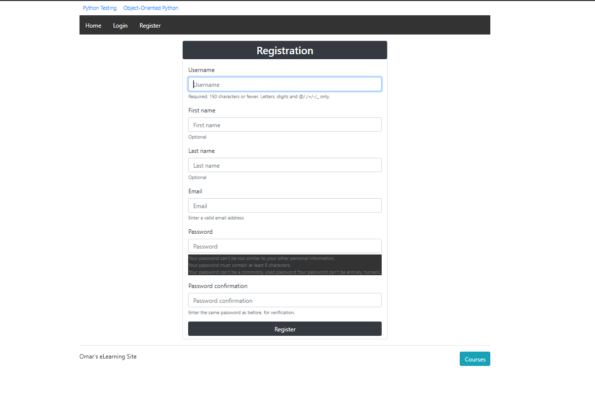
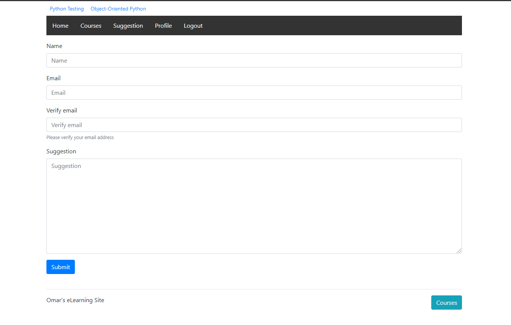
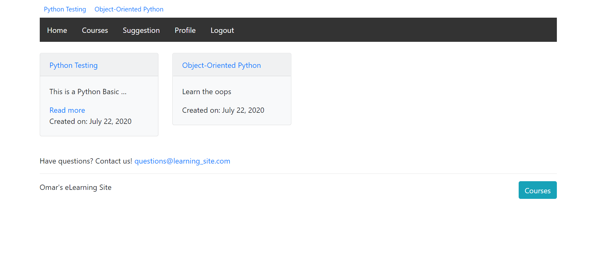
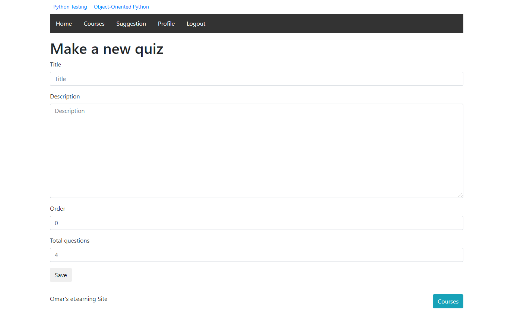
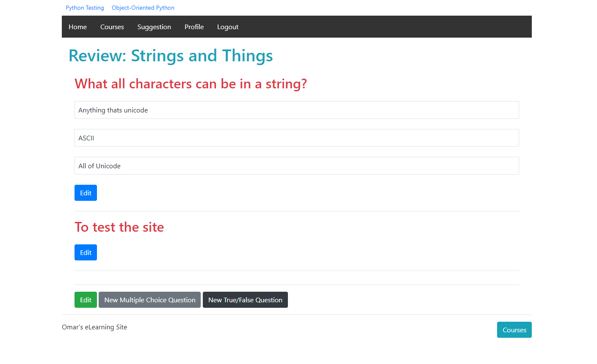
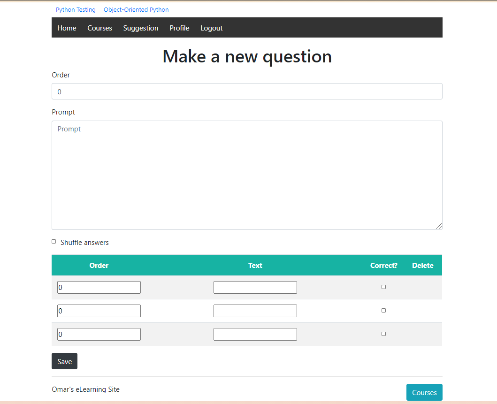

# eLearning-Website-Django
*A project on eLearning Site using Django and SQLite. Due to this pandemic situation, the activities of all educational institutions are being done online   *

# Features
```
Student Login System.
Student Registration w/ email verification
Discuss Comment Every Lesson make it more interactive !
Email Verification System.
Student Data Management.
Teacher Data Management.
Lesson Data Management.
Administrator Page for Data Management ( Students, Lesson and Teacher Data )
Student Page for learning.
Teacher Page for uploading a lesson.
Fancy Animations!
Student can attempt a quiz
User-friendly
```

# Future Work:
```
I will use React for Front-end in future.
```

# Tools
## Front-end Part
```
HTML
CSS
Bootstrap
JavaScript
```
## Back-end
```
Django
SQLite 3
```
# Screenshots of the Project
<p align="center">
  
  
  
  
  
  
</p>

**Copyright (c)** 2020-3020 Md. Omar Faruk

## Go Through This Site Then You Will Know About This Site Properly.
